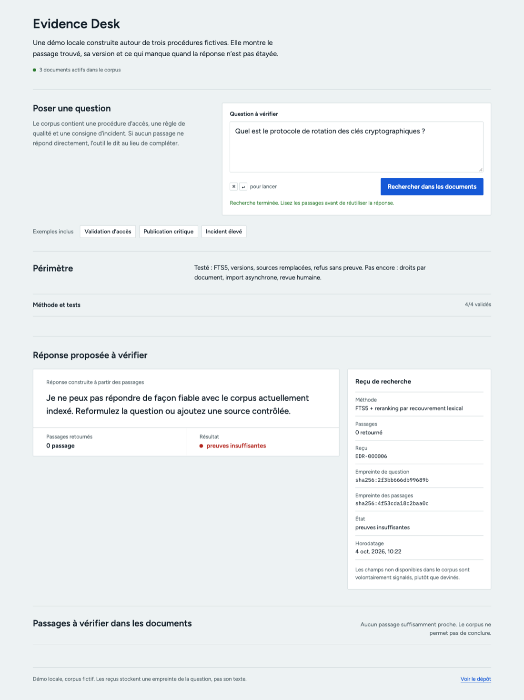

# Evidence Desk

Evidence Desk est une petite démo de recherche documentaire locale. Le corpus contient trois procédures fictives : accès, qualité de données et gestion d’incident. Une question ne reçoit une réponse que si un passage actif peut l’étayer.

Il s’agit d’un projet personnel de démonstration. Les documents livrés sont fictifs et servent à rendre les mécanismes testables. Ce n’est ni une base de connaissances client ni un service de conformité en production.

## Scénario et choix

- recherche SQLite FTS5 suivie d’un reranking lexical explicite ;
- catalogue de sources avec identifiant stable, version, propriétaire, niveau déclaré, statut et date de revue ;
- exclusion des sources `draft` ou `superseded` de la recherche ;
- préférence déclarée pour une source `authoritative` ou `controlled` lorsque la pertinence textuelle est équivalente ;
- réponse extractive citée par défaut, sans appel externe ;
- abstention explicite quand aucun passage actif ne soutient la question ;
- reçu local qui conserve les empreintes de la question et des passages, sans écrire la question en clair ;
- quatre cas de référence : trois réponses attendues et une abstention attendue.

Un fournisseur de texte peut être configuré en développement. Son résultat n’est retenu que si chaque phrase contient une référence syntaxiquement valide. Cette vérification ne prouve pas que la phrase est vraie, donc la réponse extractive reste le chemin par défaut.

## Démarrer

```bash
cd evidence-desk
PYTHONPATH=src python3 -m evidence_desk.server
```

Ouvrir ensuite `http://localhost:8080`. Au démarrage, les documents de démonstration et leur catalogue sont indexés.

Questions de démonstration :

```text
Quand faut-il faire valider une demande d’accès ?
Quel contrôle bloque un indicateur critique ?
Quand prévenir le responsable lors d’un incident élevé ?
```

Pour observer le refus, demander par exemple :

```text
Quel est le protocole de rotation des clés cryptographiques ?
```

Le corpus fourni ne contient pas cette règle. Une bonne réponse est donc un refus clair, pas une invention.

Dans l’interface, cette question ne retourne aucun passage : le résultat est « preuves insuffisantes » et le reçu ne garde que les empreintes de la question et des passages.



## Ce que l’on peut inspecter

Chaque source retournée contient :

- une citation stable de la forme `SOURCE_ID@VERSION#pPOSITION` ;
- l’extrait exact utilisé ;
- une empreinte courte du contenu ;
- le propriétaire, le niveau déclaré, le statut et le signal de fraîcheur de la source.

Chaque requête crée aussi un reçu tel que `EDR-000042`. Il associe l’empreinte normalisée de la question, la liste des passages récupérés et une empreinte de preuve. La question et la réponse en clair ne sont pas écrites dans le reçu, ce qui réduit l’exposition du texte mais ne constitue pas une garantie de confidentialité à lui seul.

## Ajouter une source en développement local

Déposer un fichier `.md`, `.txt` ou `.html` dans `data/`, puis appeler l’API avec ses métadonnées :

```json
{
  "path": "data/mon-document.md",
  "metadata": {
    "source_id": "POL-EXAMPLE-001",
    "version": "1.0",
    "authority": "controlled",
    "status": "active",
    "owner": "Data Governance",
    "reviewed_at": "2026-10-01",
    "review_due_at": "2027-04-01"
  }
}
```

Les valeurs d’autorité admises sont `authoritative`, `controlled`, `reference` et `unclassified`. Les statuts admis sont `active`, `draft` et `superseded`. Seules les sources actives peuvent appuyer une réponse.

Lorsqu’une nouvelle version active arrive avec le même `source_id`, Evidence Desk passe les versions actives précédentes à `superseded`. Le corpus ne mélange donc pas silencieusement une procédure remplacée avec sa version courante.

Le catalogue de démonstration est dans [`data/demo/catalog.json`](data/demo/catalog.json). Il sépare volontairement les métadonnées de gouvernance du texte des documents.

## API de démonstration

- `GET /api/health`
- `GET /api/documents`
- `GET /api/receipts?limit=20`
- `GET /api/evaluation`
- `POST /api/query` avec `{ "question": "..." }`
- `POST /api/ingest` avec le chemin d’un fichier déjà présent sous `data/` et des métadonnées optionnelles. Cet endpoint sert au développement local ; il ne reçoit pas de fichier uploadé et ne doit pas être exposé tel quel.

## Vérifier le projet

```bash
PYTHONPATH=src python3 -m unittest discover -s tests
```

Les tests couvrent notamment l’idempotence de l’ingestion, la provenance au niveau du passage, la mise à l’écart d’une source remplacée, l’abstention sûre et la traçabilité des cas de référence.

## Choix et limites

SQLite FTS5 est volontaire : le chemin documents, passages, recherche, réponse et preuve reste facile à inspecter. Ce projet ne prétend pas remplacer un système documentaire d’équipe. Il ne possède pas encore de gestion d’identité, de droits documentaires, d’ingestion asynchrone, de stockage vectoriel, de chiffrement applicatif ni de revue humaine intégrée.

Une version équipe demanderait au minimum une authentification, un contrôle d’accès par document, un pipeline d’ingestion isolé, une stratégie de rétention des reçus, des évaluations annotées par des personnes et une observabilité centralisée. La fiche de travail décrit ces arbitrages et les prochaines expériences dans [`docs/working-paper.md`](docs/working-paper.md).
